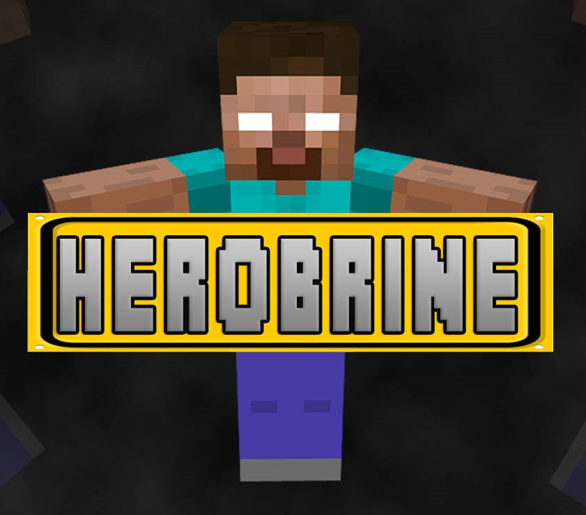
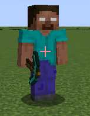
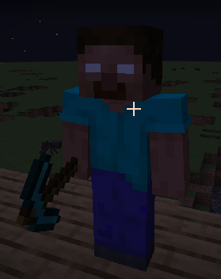
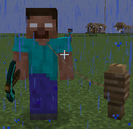

# Herobrine Helps! Kinda...

> A friendly Herobrine mod... until night falls. 😈  
> Created with NeoForge 1.21.4 by Hamzah

---

## 👁️ Description

**"Herobrine Helps! Kinda..."** is a spooky/funny Minecraft mod where Herobrine finally joins your world — but this time, he’s not all evil… **just mostly evil.**

Herobrine is your **daytime protector** — attacking hostile mobs and acting like a brave ally.  
But at night, he becomes a **chaotic menace** who might destroy villages, break doors, kill iron golems, and teleport like a glitchy ghost.

> You can even leash him to a fence like a cursed goat.  
> ...Until he breaks free.

---

## 🧠 Features

- 🕰️ **Day/Night Personality System**
  - Daytime: Helps fight mobs and defends villages
  - Nighttime: Becomes aggressive and destructive

- 🧍‍♂️ **Herobrine AI**
  - Roams the world during the day
  - Targets villagers and iron golems at night
  - Reacts to the environment and players

- 💨 **Teleportation Bug (Now a Feature!)**
  - Occasionally teleports like the original Herobrine legend

- 🪢 **Leashable!**
  - Since he’s categorized as an animal, you can **tie Herobrine to a fence** to keep him safe... for now

- 🔥 **Creepy Visuals (optional)**
  - Future versions may include particles, sound effects, and lore

---

## 🖼️ Screenshots

| Daytime | Nighttime | Fence |
|--------|-----------|------------|
|  |  |  |

> *"You tied Herobrine to a fence? That's illegal."*

---

## 🛠️ Requirements

- **Minecraft:** 1.21.4  
- **NeoForge:** 21.4.141  
- **No OptiFine (recommended)** – may cause render issues

---

## 🧪 Developer Notes

This is just version **1.0** — future versions will include:
- More animation
- Daylight transformation effects
- A Herobrine containment system (YES.)
- Sound design & voice lines
- Cursed boss mechanics and player hallucinations

---

## 💬 Feedback & Issues

Feel free to [open an issue](https://github.com/HamzahHossam12121/NeoForge-Cool-Mods-/issues) if Herobrine goes too wild (or not wild enough).

---

## 🔗 Credits

Made by: **Hamzah**  
Minecraft Modding with: **MCreator + NeoForge**
Download: [herobrine-1.0.0-neoforge-1.21.4.jar]()

---

> *“He helps. Kinda. Until the screams start.”*

